Social Media Behavior Analysis in Response to U.S. Climate Anomalies (2016-2024)

by

Zhongrui Ning

A thesis submitted

in partial fulfillment of the requirements

for the degree of

Master of Science

(Environment and Sustainability)

in the University of Michigan

April 2025

Thesis Committee:

Assistant Professor Derek Van Berkel

Associate Professor Mark Lindquist

# Table of Contents

Table of Contents

Abstract

1. Introduction of Background Information 1

1.1 Climate Change and Human Behavior 1  
1.2 Social Media as a Lens for Climate Change Analysis 2  
1.3 Research Gaps and Motivation 3  
1.4 Research Objectives and Scope 4

2. Methodology 5

2.1 Data Source and Preprocessing 5  
2.2 Mapping and Defining Climate Anomalies 6  
2.3 Computer Vision Application in Images 7  
2.4 Geospatial Integration with Climate Anomalies 8

3. Data Analysis and Results 9

3.1 General Behavioral Change Tendency Analysis 9  
3.2 Seasonal Behavior Changes and Climate Anomalies 15  
3.3 Regional Behavior Change and Climate Anomalies 18

4. Conclusion and Discussion 22

4.1 Conclusion 22  
4.2 Limitations 23  
4.3 Future Research Directions 24

References 26

Supplement Materials. 29

# Abstract:

Climate change is increasingly altering human behaviors and societal patterns across various domains. This study examines the influence of climate anomalies on human behavior and perception in the contiguous United States from 2016 to 2024. We employed a multi-method approach, integrating a large dataset of Flickr social media images and metadata with NOAA's temperature and precipitation anomaly records to analyze how extreme weather events and gradual climatic shifts shape online expressions of public behavior.

The results of the study showed significant changes in user behavior during and after climate anomaly events. There was a significant increase in the amount of content posted related to extreme weather and the natural environment, while there was a significant decrease in the amount of content shared for outdoor activities and social and cultural activities. Seasonal differences were also prominent, with higher numbers of photos and more diverse content during summer anomalies, while winter anomalies focused public attention more on environmental change. There were also differences in the patterns of influence on user behavior between temperature and precipitation anomalies, with temperature anomalies triggering broader behavioral changes. This study suggests that social media visual data can effectively complement traditional methods of assessing the impacts of climate anomalies by providing new perspectives on the dynamics of public environmental engagement.

Keywords: climate change, behavioral adaptation, social media, computer vision

# 1. Introduction of background information

# 1.1 Climate Change and Human Behavior

As the climate changes, extreme weather events are becoming more frequent and intense, altering ecosystems, disrupting infrastructure performance, and impacting daily life. Understanding the relationship between these climate stressors and our response to them is crucial for developing effective response strategies[1]. Climate change and related climate stressors like extreme heat, heavy rain and flooding are likely to cause major disruptions to everyday life including limiting outdoor activities, altering travel/commuting patterns, increasing cooling/heating energy demand, and exacerbating health risks (especially for vulnerable communities), as well as other recreational and social behaviors of daily life. For example, it is estimated that even if global warming is limited to  $1.5^{\circ}\mathrm{C}$ , climate change is projected to cause  $2.2\%$  of global working time loss per year by 2030, which is equivalent to 80 million full-time jobs, or about $2.4 trillion in economic losses[13].

Behavioral adaptations are also likely to occur as the public becomes desensitized to these disruptions, but coping with the health risks associated with climate stressors requires broader societal adaptations. High temperatures not only reduce labor productivity, but also significantly reduce outdoor working hours, and the sectors most affected include agriculture, construction, and informal labor groups in low- and middle-income countries[14].

Understanding these behavioral responses is challenging, as individuals' exposure to climate stressors varies across socioeconomic lines, occupations, and geographic contexts [22].

Recent advances in mobile technology have enabled large-scale data collection from which fine-grained spatial and temporal behavioral patterns can be inferred—using sources such as mobile phone tracking and social media activity[23]. For example, researchers can assess the immediate response of extreme weather events to public sentiment by analyzing tweets on Twitter and further understanding people's adaptive behavior[24], and when extreme weather events (e.g. heat waves or heavy rainfall) occur, cell phone location data (e.g. cellular base station data or GPS data) within and outside of the city can change significantly[25]. In particular, photos and textual content shared on social media platforms offer a valuable proxy

for observing behavioral shifts in response to climate stressors, given their rich emotional, spatial, and behavioral context.

# 1.2 Social Media as a Lens for Climate Change Analysis

Social media has emerged as a tool for capturing real-time public engagement with diverse topics including climate change. Research has demonstrated that real-time updates of social media data can provide information about what people say during natural disasters, thus helping interested parties in their crisis response[2]. On platforms such as Flickr, spatial data is precisely tagged with latitude and longitude coordinates to five decimal places, providing an accuracy of approximately one meter[3]. For example, photos of extreme weather, personal stories of displacement, or debates over sustainability have revealed how individuals and communities perceive, adapt to, and advocate for action on climate threats. These digital interactions highlight behavioral shifts, such as reduced outdoor activity due to wildfire smoke or increased interest in eco-friendly lifestyles[15]. Social media facilitates the rapid dissemination of information, mobilizes virtual communities, and bridges the gap between scientific discussion and public understanding. Massive user engagement on these platforms provides a rich and complex source of data. However, this richness is also accompanied by a high degree of repetition and redundancy, as users often post duplicate or similar content, tags, or images, which creates challenges for large-scale behavioral analysis. For researchers, analyzing social media platform data provides lenses to study climate-related decision-making, while policymakers gain visibility into public priorities, enabling more responsive strategies.

While methods such as Natural Language Processing (NLP), Sentiment Analysis, Computer Vision, and GeoAI have advanced our understanding of public engagement with climate change through social media, existing studies remain constrained by critical limitations[26]. Most research focuses on short-term (3-5 year) analyses of discrete events—such as sentiment tracking during hurricanes or heatwaves—and relies heavily on single-modality data, typically text-centric platforms like Twitter. Previous studies have validated the effectiveness of NLP techniques, such as BERT, in constructing topic models related to natural disasters and environmental events[4]. Similar techniques have been applied within language modeling for analyzing climate change related topics in social media[5][6]. These

approaches, while valuable for capturing immediate public reactions, fail to account for the longitudinal and multidimensional nature of climate impacts. For example, gradual behavioral adaptations driven by recurring stressors, such as multi year droughts or incremental temperature rises—are often invisible to event-centric frameworks[27].

Additionally, the lack of spatial granularity in many studies limits their utility for localized policy interventions, as they cannot pinpoint where behavioral shifts align with climatic vulnerabilities[28].

Social media platforms offer transformative opportunities to address these gaps with their unique focus on high-resolution geotagged imagery and depth of archiving spanning decades. By using computer vision techniques to synthesize visual narratives of landscape change, applying NLP sentiment analysis to parse textual descriptions of personal experiences, and processing precise spatio-temporal metadata with GeoAI, Flickr data enables researchers to map acute versus chronic climate-driven behavioral change. For example, analyzing decades of geo-tagged photos through computer vision can reveal how coastal communities are gradually reducing beach recreation in response to sea level rise, while sentiment analysis of accompanying text can track the evolution of public attitudes from curiosity to anxiety [29].

# 1.3 Research Gaps and Motivation

Previous research has focused on various public emotional and behavioral responses to climate change, with many different variables, such as gender, income, age, geographic location and so on[7]. And in terms of natural factors, climate disasters caused by extreme temperature and precipitation events are most likely to generate discussion and analysis of climate change among people on social media platforms[8]. Meanwhile, social media keywords and image extraction have been effective in characterizing crisis narratives and adaptation initiatives in public discussions related to identifying natural disasters, validating the feasibility of social media as a “social sensor”[9]. By combining converter-based text analysis (BERT) to capture sentiment and behavioral context, visual language modeling (CLIP) to categorize image content, and spatial analytics (GeoAI) to link climate anomalies to user behavior, we identify long-term behavioral changes in response to climate stressors.

Despite these studies, there is limited research on long-term behavioral changes caused by climate-related factors in the contiguous United States. While social media has been widely used to analyze recreational behaviors, responses to natural disasters, and engagement with extreme weather events, little work has investigated how these events shape public behavior and perception over extended periods. This study explores how climate change affects public behavior by analyzing twenty years of geotagged Flickr data from the contiguous United States (2016-2024), combined with advanced computational methods and spatial analysis.

# 1.4 Research Objectives and Scope

The aim of this study is to assess if social media can be used to detect behavioral changes from climate change, namely climate anomalies and we're trying to figure out if there change in social media posting behavior during climate anomalies events and does this change over space and time in the contiguous U.S.

This study not only quantifies human-climate interactions with unprecedented spatial and temporal resolution, but also provides actionable tools for policymakers. Interactive dashboards align behavioral hotspots, such as clusters of extreme heat-related posts, with the NOAA Climate Anomaly Grid to support precision interventions, from expanding summer vacation centers in heat-vulnerable cities to prioritizing flood resilience infrastructure in emotionally anxious coastal zones. By combining computational social science with environmental analytics, we use social media as a mapping window to social change, interpreting human perceptions and behavioral responses to climate change through images, textual narratives, and geospatial data.

# 2. Methodology

# 2.1 Overview

To assess behavioral responses to climate anomalies, we analyzed Flickr metadata from 2016 to 2024 across the contiguous U.S., using image timestamps, locations, and user activity patterns as behavioral indicators. These data were spatially and temporally matched with gridded temperature and precipitation records from NOAA to identify extreme climate events. Kernel density estimation was used to detect geographic hotspots where anomalies—such as elevated temperatures—aligned with shifts in user behavior, such as reduced outdoor recreation imagery in the Midwest during periods of extreme heat. We further analyzed content using machine learning models. A fine-tuned BERT model was applied to photo titles and descriptions to classify sentiment into four categories: pro-adaptation, neutral, climate skepticism, and crisis narrative. This enabled the detection of nuanced public attitudes—for example, distinguishing between genuine support and ironic denial.

Additionally, CLIP, a multimodal model linking text and images, was used for zero-shot classification of imagery. By measuring semantic similarity with predefined climate-related keywords, CLIP identified visual themes such as extreme weather, pollution, and environmental degradation, allowing us to trace shifts in visual expression alongside meteorological anomalies.

# 2.1 Data source and preprocessing:

We began by downloading all available Flickr metadata—including text descriptions, image URLs, geolocation coordinates, and timestamps—for the contiguous United States from 2016 to 2024. This included over 10 million posts from x users. We cleaned the database by filtering out irrelevant content and reduced noise.

Geospatial accuracy was ensured by filtering posts of missing latitudes/longitudes coordinates. The time of the metadata was then matched with the location and time of identified climate anomalies, enabling the analysis of both short-term reactions and long-term trends in public engagement with climate change.

# 2.2 Mapping and defining Climate anomalies

We define climate anomaly events using the Z-score normalization method combined with temporal continuity analysis to accurately identify events that significantly deviate from normal climate patterns over an extended period[10]. We use city-level data to enable precise matching with location-specific Flickr content and to capture meaningful localized climate anomalies. First, we calculate temperature anomalies and precipitation anomalies for each city from 2016 to 2024 and determine abnormal days using the Z-score. A day is considered anomalous if its climate variable (temperature or precipitation) deviates by 2 or more standard deviations  $(|Z| \geq 2)$  from the city's historical mean value. To avoid statistical noise from isolated anomalies, we further filter events that persist for at least 5 consecutive days[11] and compute the total number of long-term anomaly days for each city. Finally, we identify the cities with the most and least temperature anomalies and the cities with the most and least precipitation anomalies, which are used for subsequent Flickr data matching and computer vision analysis. This method ensures that anomaly detection is based on each city's historical climate data, rather than relying on a global threshold, and incorporates temporal continuity analysis to align the definition of anomalies with real-world climate patterns.

The raw climate data we downloaded from NOAA are automatically recorded by the weather stations distributed all around the U.S., which are not evenly distributed and cannot be directly mapped to specific high-precision geographic information in the Flickr dataset. Therefore, to connect the general distribution of climate anomalies with human behavior more specifically, we next explore how these climate events are reflected in social media activity.

Firstly, we build a reference map by matching the latitude and longitude for each unique WOEID(Where On Earth ID)[20] recorded in our flickr dataset with a certain city. Then, we use KDTree nearest-neighbor search, that is a tree data structure used to organize data points in a k-dimensional space by partitioning the space into hyper-rectangles for efficient Nearest Neighbor Search or Range Query, to match each climate record to the closest WOEID based on geographic proximity.

Once WOEID is assigned, we merge the climate data with Flickr records using WOEID and date as keys. This allows us to analyze how social media activity corresponds to temperature and precipitation anomalies, thus revealing how people in different cities may be reacting behaviorally to climate change.

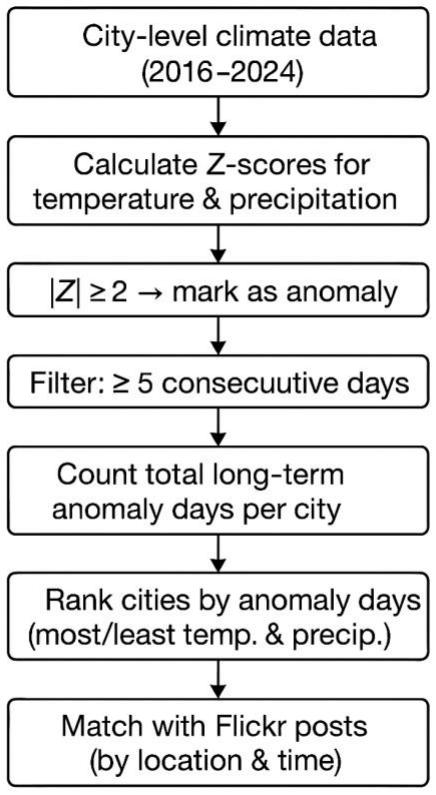  
Figure 1: Process Flow for Climate Anomaly Detection and Flickr Data Correlation

# 2.3 Computer Vision Application in Images

To efficiently analyze visual content, we implemented a multithreaded image download strategy using Python's ThreadPoolExecutor. This approach allowed us to fetch images from Flickr while filtering out inaccessible, corrupted, or duplicate URLs. Additionally, we employed a checkpointing mechanism to ensure that the download process resumed seamlessly in the event of an interruption, thus avoiding redundant image processing efforts.

Rather than relying on simple climate-related keywords, we systematically categorized the images into five broad categories, each reflecting a different aspect of human interaction with the environment:

Natural Environment includes images depicting weather conditions and landscapes such as sun, rain, snow, storms, and wildfires. This category was chosen because changes in climate anomalies significantly influence observable weather phenomena and landscape conditions.

Outdoor Activities comprises images capturing human interactions with the environment, such as hiking, cycling, and fishing. It was assumed that outdoor activities would decrease during climate anomalies due to adverse conditions limiting outdoor recreational behavior.

Urban Activities represents social and economic behaviors occurring in urban settings, including shopping, attending concerts, or visiting cafes. This group aims to track whether climate anomalies influence routine urban lifestyles and consumption behaviors.

Extreme Weather & Impact highlights images showing the consequences of severe weather events, such as floods and droughts, and their direct impacts like damaged infrastructure. This category explicitly addresses the direct visual evidence of climate-induced disturbances.

Social & Cultural Activities includes images illustrating collective responses, such as protests or public gatherings. This classification helps identify how communities collectively respond or adapt to climate events or other environmental stressors.

Using the CLIP model, we investigated temporal changes in image content by comparing visual trends between cities with high and low climate anomalies. This comparative analysis allows us to gain a clearer understanding of how climate disruption affects human behavioral patterns over time.

# 2.4 Geospatial Integration with Climate Anomalies

To investigate the spatiotemporal relationship between user behaviors and climate anomalies, we integrated Flickr image metadata (timestamps, geolocations, and user-generated content) with NOAA climate anomaly records. Cities were classified based on their climate anomaly intensity, selecting the top and bottom anomaly regions for comparative analysis. This

approach allowed us to examine how regions with frequent extreme weather events differ from more stable climate zones in terms of image content trends and behavioral changes.

# 3. Data analysis and Results

# 3.1 General behavior change tendency analysis:

Between 2016 and 2024, a total of 1188 climate anomalies (233 temperature anomalies and 955 precipitation anomalies) were identified in this study, covering 9862 cities, and cumulatively analyzing about 10 million social media posts. Detailed information on the anomaly detection criteria and city information provided in supplemental material.

The number of city photographs increases significantly as the degree of temperature anomaly increases (Figure 1). Cities in the "high" temperature anomaly class had significantly more photos than those in the "low" and "medium" classes  $(p < 0.0001)$ . This suggests that more extreme temperature anomalies are significantly associated with higher photographic behavior, which may be related to increased public attention to heat events, more pronounced changes in the environmental landscape, or temperature-related seasonal behavioral patterns. In contrast, precipitation anomalies had a less consistent effect on the number of photographs. The number of photographs was slightly higher in the "high" anomaly class cities than in the "medium" anomaly class group, and slightly higher in the "medium" than in the "low" anomaly class group, but not in the "high" anomaly class cities than in the "medium" anomaly class group. "(p < 0.05), but there was no statistically significant difference between "low" and "high" (ns). This may indicate that precipitation anomalies have a more indirect effect on people's photo-taking behavior or vary by time and region. Temperature anomalies are a stronger and more consistent contributor to changes in the number of photos taken in the city. Precipitation anomalies, on the other hand, had a relatively weak and unstable effect. This is consistent with our intuition that extreme high or low temperatures are more likely to have a direct effect on people's behavior, willingness to share their visual environment, or to be outdoors.

This trend suggests that extreme weather events and significant climate disruptions are more likely to trigger social media activity. In contrast, lower severity climate anomalies (e.g., minor temperature fluctuations or occasional precipitation deviations) had less of an impact on social media discussions. This phenomenon is consistent with previous findings

suggesting that regions with more severe climate change/climate anomalies that occur more frequently are more likely to trigger fluctuations in social media postings [28].

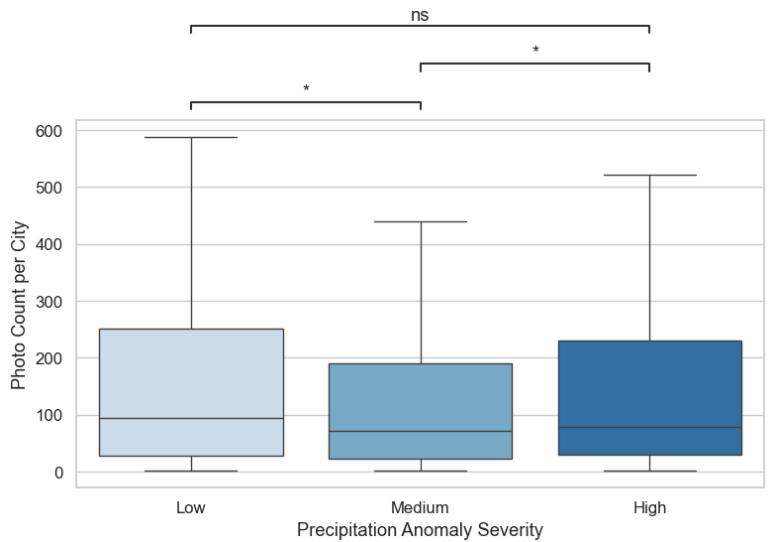  
Figure 2. Boxplots for photo counts per city under different climate anomaly severities (2016-2024). Boxplots show photo count distributions across cities by anomaly severity. The top panel represents precipitation anomalies (blue), and the bottom shows

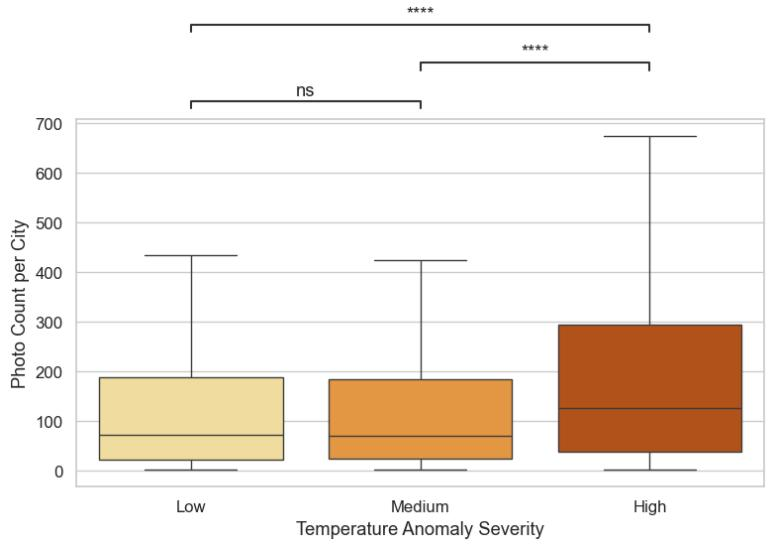

temperature anomalies (orange). Statistical significance is marked with asterisks (* p < 0.05; ** p < 0.01; **** p < 0.0001), while ns indicates no significant difference. Higher temperature severity levels are linked to significantly more photos, while precipitation shows weaker or less consistent effects.

The average number of photos related to climate anomalies after the event (Post) increased to 57.06 from 32.75 before the event (Pre), and the number of users increased from 28.25 to 41.44, indicating that climate anomalies can significantly increase the public's attention to disaster-related content and their willingness to share. sharing willingness. Meanwhile, the standard deviation of this category in the post-event stage reaches 132.01, which is significantly higher than that in other stages, reflecting a high degree of heterogeneity in the sharing social media, which may be due to the differences in the severity of the event, the scope of its impact, and the spreading effect.

The number of photos and users in the Natural Environment category also showed a significant increase during the climate anomaly. The average number of photos increased from 50.82 (Pre) to 113.38 (Post), and the number of users increased from 44.65 to 77.62. This change suggests that the climate anomaly greatly contributed to the public's attention to and documentation of changes in natural landscapes. Meanwhile, the standard deviation of the post-event stage of this category also significantly widened to 248.25, implying that there are large differences in the perception of and response to changes in the natural environment among different individuals, which may be related to the differences in the degree of regional disaster impacts and recovery status.

In contrast to the above trend, the Outdoor Activities category shows a decline in both photos and users during the climate anomaly, with the average number of photos dropping to 20.88 and the number of users dropping to 23.44. This declining trend suggests that the extreme weather events restricted the public's outdoor recreation to a certain extent, leading to a decrease in the sharing of related content. This category showed less variation in standard deviation across the phases, suggesting a more consistent behavioral response from users in this area.

The Social & Cultural Activities category showed a consistent downward trend both during and after the climate anomaly. The number of photos decreased from 12.0 before the event to 9.32 (During) and further to 7.72 (Post), with a similar change in the number of users. This result suggests that climate anomaly events may have weakened the public's willingness to

participate and share in the socio-cultural category. The overall low standard deviation for this category (e.g. 13.86 before the event) reflects a high degree of consistency and clarity in changes in user behavior.

The Urban & Human Activities category, on the other hand, showed a gradual decline. The number of users decreased from 30.56 to 23.56 during the event (During) and remained at a lower level after the event. This change may be related to the limitation of urban activities during the climate anomaly and the decrease in the frequency of public recording of urban life. Meanwhile, the standard deviation of this category during the anomaly was 88.05, showing that there is a large variability among different cities or individuals in recording the content of urban activities.

Overall, the behavioral effects of climate anomalies on social media showed significant category differences. The extreme weather and natural environment categories showed significant increases in the number of photos and users both during and after the event, while the outdoor activities, social and cultural activities, and urban life categories showed decreasing trends. In addition, there was a general increase in data volatility after the event, further suggesting that climate anomalies triggered a high degree of heterogeneity in public behavioral responses.

<table><tr><td>Category</td><td>AveragePhotoPre</td><td>AveragePhotoPost</td><td>AveragePhotoDuring</td><td>AverageUse rPre</td><td>AverageUser Post</td><td>AverageUser During</td></tr><tr><td>Extreme Weather &amp; Impact</td><td>32.75(82.67)</td><td>57.06(132.01)</td><td>59.72(94.08)</td><td>28.25(68.97)</td><td>41.44(87.87)</td><td>42.65(77.53)</td></tr><tr><td>Natural Environment</td><td>50.82(128.81)</td><td>113.38(248.25)</td><td>78.56(166.32)</td><td>44.65(109.52)</td><td>77.62(160.96)</td><td>55.31(120.83)</td></tr><tr><td>Outdoor Activities</td><td>28.36(50.45)</td><td>32.4(75.5)</td><td>20.88(69.37)</td><td>25.73(42.97)</td><td>24.67(51.35)</td><td>23.44(44.34)</td></tr><tr><td>Social &amp; Cultural Activities</td><td>12.0(13.86)</td><td>11.67(20.53 )</td><td>9.32(18.04)</td><td>12.0(13.86)</td><td>8.5(14.71)</td><td>7.72(15.72)</td></tr><tr><td>Urban &amp; Human Activities</td><td>36.33(73.92)</td><td>39.25(90.99 )</td><td>34.14(88.05)</td><td>30.56(61.55)</td><td>28.67(62.78)</td><td>23.56(64.96)</td></tr></table>

Table 1. Flickr posts content changes in different categories before, during and after climatic anomalies in per 500 posts (with standard deviation in the bracelet)

Pairwise Category Differences During Climate Anomalies

To further examine the internal distribution of user engagement across thematic categories during climate anomaly periods, pairwise comparisons were performed between computer vision category pairs using Mann-Whitney U tests with Bonferroni correction for multiple comparisons [29], mainly focused on the categories of Natural Environment, Extreme Weather & Impacts, and Outdoor Activities, which were identified using a CLIP-based computer vision model (n =100000). The resulting p-values were for both temperature and precipitation anomalies (Table 2).

In the case of temperature anomalies, the pairwise analysis indicated that "Outdoor

Activities" differed significantly from "Extreme Weather & Impact"  $(p < 0.001)$ , "Urban & Human Activities"  $(p = 0.012)$ , and "Natural Environment"  $(p = 0.032)$ . This suggests that during periods of extreme temperature, outdoor-related content exhibited a distinct increase compared to other categories, while urban and social content remained comparatively low.

During precipitation anomalies, the differences between categories were even more

pronounced. Significant differences were observed between "Outdoor Activities" and "Social & Cultural Activities"  $(p < 0.001)$ , as well as between "Natural Environment" and "Social & Cultural Activities"  $(p < 0.001)$ . Additionally, "Extreme Weather & Impact" content differed significantly from both "Urban & Human Activities"  $(p = 0.039)$  and "Social & Cultural Activities"  $(p < 0.001)$ .

These results indicate that under conditions of precipitation anomalies, user engagement

shifts heavily toward nature- and weather-related content, while engagement with social and

urban themes declines substantially. The findings highlight the sensitivity of online content

creation to specific types of climate stress, with outdoor and natural environment categories

being particularly responsive.

<table><tr><td>Group1</td><td>Group2</td><td>Bonferroni-adjusted p-value</td></tr><tr><td>Urban &amp; Human Activities</td><td>Outdoor Activities</td><td>0.012</td></tr><tr><td>Outdoor Activities</td><td>Extreme Weather &amp; Impact</td><td>&lt;0.001</td></tr><tr><td>Outdoor Activities</td><td>Natural Environment</td><td>0.032</td></tr></table>

Table 2.a: Mann-Whitney U Test Results (Temperature Anomalies)

<table><tr><td>Group1</td><td>Group2</td><td>Bonferroni-adjusted p-value</td></tr><tr><td>Outdoor Activities</td><td>Natural Environment</td><td>&lt;0.001</td></tr><tr><td>Outdoor Activities</td><td>Social &amp; Cultural Activities</td><td>&lt;0.001</td></tr><tr><td>Natural Environment</td><td>Social &amp; Cultural Activities</td><td>&lt;0.001</td></tr><tr><td>Urban &amp; Human Activities</td><td>Extreme Weather &amp; Impact</td><td>0.039</td></tr><tr><td>Social &amp; Cultural Activities</td><td>Extreme Weather &amp; Impact</td><td>&lt;0.001</td></tr></table>

Table 2.b: Mann-Whitney U Test Results (Precipitation Anomalies)

# 3.2 Seasonal Behavior Changes and Climate Anomalies:

Seasonal differences in behavior from climate anomalies were apparent in extreme heat and less conclusive in cold extremes (fig 2a & b).

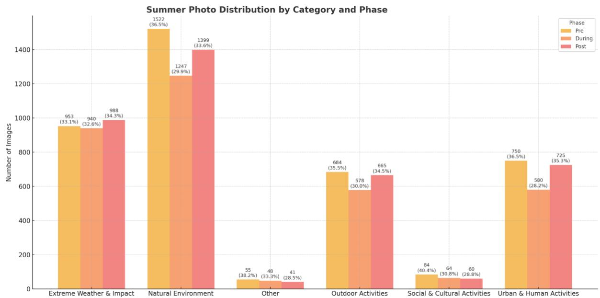

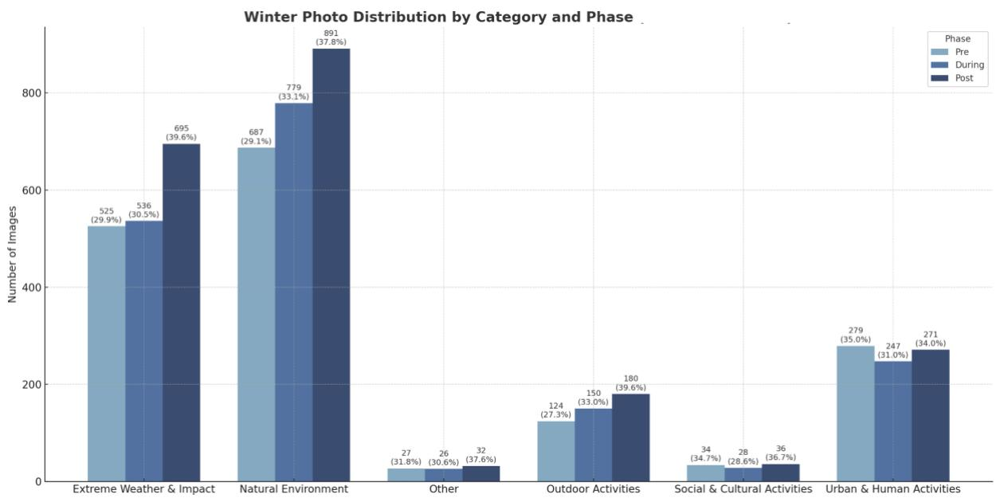  
Figure 2a & 2b. seasonal content change in the distribution of image content during climate anomalies per 10,000 photos

Figure 2a & 2b shows the distribution of image content across different categories during climate anomalies per 10,000 photos, comparing the percentage of images in each category between winter and summer in the 5 categories.

As can be seen from the histograms for the summer months, the number of photos posted by users during the climatic anomaly varied significantly between categories, with the overall number of photos taken being higher than in the winter months. The Natural Environment category remained the dominant theme during the summer months, accounting for a larger proportion of the total number of photos taken in all phases. Content related to the natural environment remained high on users' radar even during the weather anomaly (During phase).

Meanwhile, the Outdoor activity category performed particularly well in the summer, especially growing significantly in the Post phase, suggesting that climate anomalies did not significantly inhibit public participation in the outdoors, but instead led to an increase in social sharing activities for more environmental interactions. The Urban & Human Activity category also shows high activity in the summer, especially in the Post (Post) phase, with a

further increase in the number of photos, which may be related to urban recovery and return of life after the climate anomaly. And the category of Extreme Weather and its Impacts shows a slight increase in the share of photos during the Period of Abnormalities (During), indicating that users tend to record extreme phenomena and their social and environmental impacts during the outbreak of climate anomalies.

In contrast, the grouped bar charts for winter show very different patterns of user behavior than in summer. First, the overall number of photos is significantly lower than in the summer, reflecting the fact that users' outdoor shooting activities are significantly suppressed in cold weather conditions. In winter, 'natural environment' is still the dominant theme, but its share in all phases is slightly lower than in summer, possibly reflecting the limitations of photographing natural environments in winter. The Urban & Human Activity category increased in importance during the winter months, especially during the Developing and Post phases, with a significant increase in the number of photos taken, suggesting that the cold weather caused users to focus more on inner-city activities and indoor scenes. The Extreme Weather and its Impacts category showed a significant increase in the share of the During stage, indicating that more members of the public tend to record these environmental changes when they are in extreme winter weather. The Outdoor and Social and Cultural Activities category has a relatively low number of shots in winter, showing that cold weather significantly inhibits the frequency of outdoor social and cultural activities.

A comparison of the two grouped bar charts in summer and winter shows that users' shooting behavior during climate anomalies exhibits significant seasonal differences. During the summer period, warmer weather, longer daytime hours, and abundant outdoor resources contributed to a significant increase in user shooting activity and a significant increase in the number of photos. During winter, on the other hand, the cold significantly dampened the overall number of photos taken, and user shooting behavior shifted from outdoor to urban, indoor and extreme weather recording.

Overall, this clear seasonal variation shows that there is an adaptation of user behavior to environmental conditions and climate anomaly events. The impact of climate anomalies on social behavior is dynamically moderated in different seasonal contexts.

# 3.3 Regional Behavior Change and Climate Anomalies:

This section examines how social media engagement may vary across different U.S. regions in response to climate anomaly events. The purpose is to test whether distinct patterns of behavioral change emerge between regions during such events. Based on climatic and cultural differences, it is expected that the Northeast and the South—due to their greater historical exposure to extreme weather events such as hurricanes and blizzards—will exhibit stronger and more immediate increases in engagement following climate anomalies. In contrast, the Midwest and the West may show weaker or more delayed behavioral responses due to differences in climate severity, population density, and perceived risk levels.

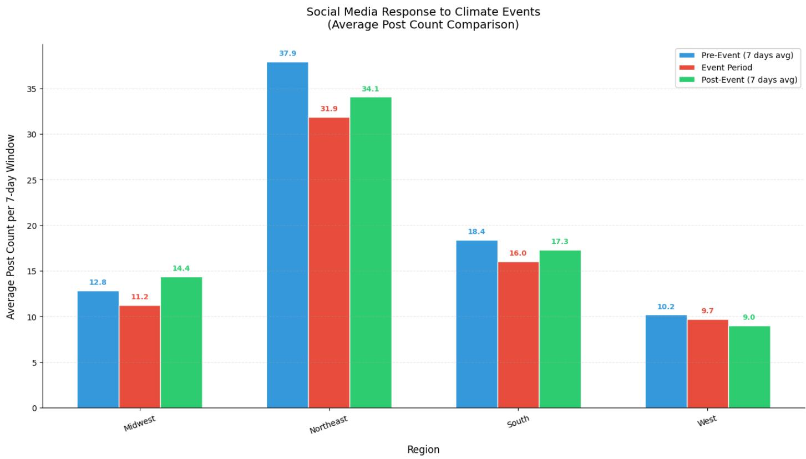  
Figure 8: Average Regional Social Media Response to Climate Anomalies

This bar chart (Figure 8) shows the average social media response to climate anomalies (as measured by the number of posts) in different regions of the United States. Each bar represents the average change in the number of posts during a climate anomaly.

In the Northeast, social media engagement increased significantly, especially in the post-event phase (green bars), reaching an average of 34.1 daily posts. This suggests that users in this region show stronger discussion and engagement after a climate event. During the event (red bars), on the other hand, postings were lower, dropping to 31.9 average daily postings, suggesting that the public's response lagged slightly when the event occurred.

In contrast, postings in the southern region were similar during the event to those before the event (blue bars), but increased after the event suggesting that the subsequent impacts of the climate event were more pronounced in the region, especially in terms of outdoor activities or restorative discussions. The West region, on the other hand, showed less fluctuation, with little change in postings during and after the event, at 9.7 and 9.0 average daily postings, respectively.

Additionally, the Midwest showed less variation, with a closer difference between pre- and post-event postings at 12.8 and 14.4 average daily postings, respectively. This suggests that although the region experienced a slight decrease in participation during the climate event (11.2 entries), the overall change in participation was more moderate.

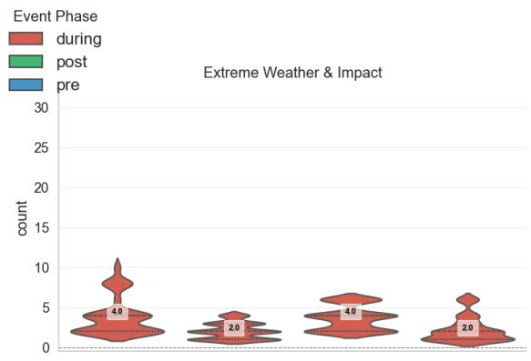

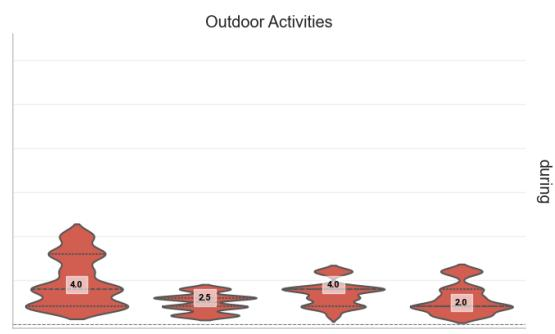

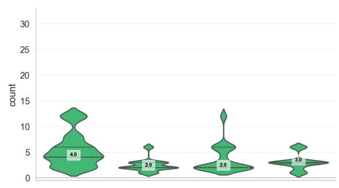

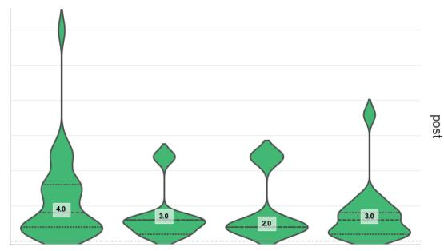

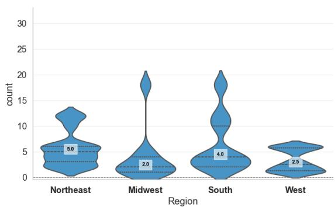  
Figure 9: Regional Distribution of Flickr Posts for Extreme Weather & Outdoor Activities Across Event Phases

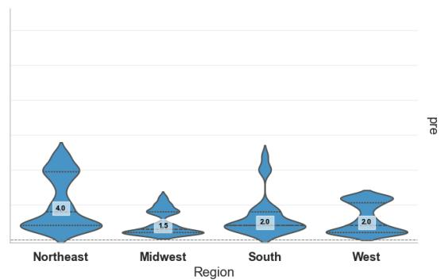

Figure 9 presents a violin plot visualization of average daily post count distributions across different regions and categories during three phases of climate events: pre-event, during-event, and post-event. The width of each violin represents the density of posts at specific counts, while the thick line in the middle of each plot indicates the median, providing insight into central tendencies within the data.

In the pre-event phase (bottom blue violins), baseline posting activity exhibits clear regional and categorical variation. The Northeast shows a significantly higher level of engagement across both "Extreme Weather & Impact" and "Outdoor Activities" categories, suggesting heightened public attention in anticipation of climate events. The South also demonstrates notable pre-event activity, particularly in the "Extreme Weather & Impact" category. In contrast, the Midwest and West generally report lower baseline engagement, with relatively narrower violins indicating less overall pre-event activity.

During the event phase (top red violins), we observe distinct patterns of increased engagement. For "Extreme Weather & Impact" (left plot), a marked surge in posts is evident in both the South and Northeast, where wider violins reflect higher posting volumes. This indicates a strong public reaction to climate anomalies in these regions. The Midwest and West, however, show a less pronounced increase, as evidenced by the narrower violins, suggesting a more muted response to the event. For "Outdoor Activities" (right plot), activity remains relatively subdued across all regions during the event phase, with only slight deviations from baseline engagement, indicating less public focus on recreational activities during extreme weather events.

In the post-event phase (middle green violins), the trends diverge. In the “Extreme Weather & Impact” category, the South exhibits a sustained increase in activity compared to pre-event levels, suggesting continued public concern and reflection on the impacts of the climate event. Conversely, the Northeast, Midwest, and West show a decrease in activity following the event, as indicated by narrower violins, suggesting a return to baseline levels. However, for “Outdoor Activities,” the Northeast stands out with a significant post-event rebound in engagement, suggesting a recovery in outdoor activity after the event. The South and West show slight increases in post-event engagement, while the Midwest remains at a relatively low level, reflecting the ongoing subdued nature of public participation in outdoor activities in these regions.

# 4. Conclusion & Discussion

# 4.1 Conclusion

This study assessed whether social media, specifically Flickr image sharing behavior, can serve as a measure of changes in public behavior during climate anomalies in the contiguous American region from 2016 to 2024. We aimed to answer:(1) Does social media posting behavior change during climate anomaly events? And (2) how does this vary across spatial and temporal dimensions?

The results of the study suggest that social media posting behavior changes during climate anomalous events. The number of posts related to outdoor activities, urban human activities, and socio-cultural topics decreased significantly during climate events, while the number of posts related to the natural environment and extreme weather impacts increased significantly in the post-event phase. This pattern suggests a substantial shift in public engagement at the onset of a climate disruption, with a significant rise in attention to environmental and disaster-related topics in particular.

Further analysis reveals that this behavioral response exhibits significant spatial and temporal heterogeneity. At the regional level, the northeastern and southern regions showed stronger behavioral changes following climate events, displaying higher sensitivity and engagement; while the western and midwestern regions showed relatively stable performance. From a temporal perspective, the seasonal differences are particularly striking: content related to outdoor activities spiked during the summer months, while content related to the natural environment and extreme weather was more likely to be shared during the winter months, reflecting seasonal differences in public interest and activity. These results confirm that social media data can not only detect behavioral changes triggered by climate anomalies, but also capture their spatial and temporal dynamics, informing the understanding of public environmental perceptions.

The ability to detect behavioral shifts via social media in response to climate anomalies suggests that digital platforms can serve as supplementary sensors for environmental and societal monitoring, complementing traditional climate observation systems [33]. The consistent surge in posts related to extreme weather and natural environments during and

after climate events across multiple regions provides robust evidence of heightened public concern and reactive behavior.

Regional differences in responses highlight the importance of contextual factors, such as climate risk exposure, population density, and socio-cultural resilience. The Northeast's strong engagement may reflect both the frequency of impactful events and a higher reliance on digital communication in dense urban settings. In contrast, more muted responses in the West and Midwest may stem from broader spatial dispersion, lower media saturation, or different cultural relationships with environmental risks [32].

Seasonal variations further refine this understanding. Warmer seasons encourage increased outdoor activity and sharing behaviors, while colder seasons heighten environmental awareness. These patterns align with previous findings that environmental salience and personal experience significantly shape climate-related discourse online [31].

It is important to note that while Flickr serves as a useful case study platform, extending analyses across multiple social media ecosystems could validate and enrich these findings [30]. Furthermore, improvements in computer vision models, particularly those that integrate multimodal information, would enhance the accuracy of content interpretation [21].

Ultimately, this study demonstrates that behavioral responses to climate anomalies are detectable, measurable, and meaningfully variable across both space and time. Social media thus offers a promising, albeit complex, lens through which to monitor societal impacts of climate change in near real-time.

# 4.2 Limitations:

Despite the conclusions reached in this study, some limitations that may affect the direction of future research should be recognized.

First, this study relied only on Flickr data from 2016 to 2024, focusing primarily on climate anomaly events. This narrow data source may not fully capture what is being discussed and shared on other social media platforms. Other platforms such as Instagram, X, and Facebook have different user demographics and content dynamics that could provide a more

comprehensive picture of climate change discussions and manifestations. A broader collection of data from multiple platforms could provide a more complete picture of public engagement with climate-related events.

Furthermore, the timeframe of this study is limited to specific climate anomalies between 2016 and 2024, and despite the introduction of seasonal and regional analyses, there are many shortcomings when considering long-term trends or gradual changes in climate-related discussions. Extreme weather events often trigger immediate reactions, while the long-term effects of ongoing climate change may influence public opinion and content creation in different ways.

While this study utilizes CLIP-based image classification to analyze content, these approaches have limitations in adequately capturing the depth and nuance of climate change discussions. For example, the impact of certain thematic discussions on public behavior, such as climate policy and systemic environmental change, may not be adequately captured, and CLIP's image categorization suffers from a certain degree of error and misclassification (e.g., a scenic painting of a lake was mistakenly identified as a flood event).

# 4.3 Discussion of Future Research Directions

While this study provides insights into how social media reflects the public's response to climate change, there are several areas where further research could enhance our understanding.

Data sources: As mentioned earlier, expanding the dataset to include a variety of social media platforms could provide a more diverse perspective on user behavior. Each platform has its own dynamics in terms of engagement and the types of content created by users. By including data from platforms such as Instagram, X, or Facebook[30], we can determine if the patterns we observe on Flickr are consistent across social media spaces or if they are unique to a particular platform.

Longitudinal analysis: This study focuses primarily on analyzing the transient effects of climate events, especially when specific climate events occur. However, climate change is a long-term issue and its impact on public behavior may evolve over time. A longitudinal

approach that tracks user behavior over multiple years will provide more insight into how engagement with climate-related content changes as awareness of climate change grows. This may also reveal long-term changes in public attitudes and behaviors related to ongoing environmental change.

Interdisciplinary Approaches: There is still much work to be done to integrate social media analytics with climate science. Future research could benefit from integrating insights from fields such as psychology, sociology, and environmental science to gain a more comprehensive understanding of how people perceive climate change and how their behaviors are influenced by these perceptions[31]. For example, examining how personal experiences with climate events, media coverage, and government policies influence individual attitudes toward climate change could provide valuable contextual information for the patterns we observed in this study.

Higher accuracy computer vision modeling: Further improvements in visual model analysis are needed to increase accuracy and extract more nuanced information. Future work could explore the use of more advanced computer vision models, possibly incorporating techniques such as attentional mechanisms or Transformer-based architectures, to improve the accuracy of image classification and object recognition. Developing analytics that incorporate relevant text and metadata to help reduce misclassification and provide a richer understanding of visual content [21].

In summary, the analysis of social media responses following climate anomalies in different regions of the United States reveals significant geographic differences in public perceptions of and responses to climate change. These differences are influenced by a variety of factors, including geographic location, climate type, socioeconomic conditions, cultural background, and residents' ability to adapt to climate risks. An in-depth understanding of these regional differences is essential for the development of targeted climate communication strategies and policies to more effectively raise public climate awareness and promote climate adaptation and mitigation actions.

# References

[1] IPCC, 2023: Climate Change 2023: Synthesis Report. Contribution of Working Groups I, II and III to the Sixth Assessment Report of the Intergovernmental Panel on Climate Change [Core Writing Team, H. Lee and J. Romero (eds.)]. IPCC, Geneva, Switzerland, pp. 35-115, doi: 10.59327/IPCC/AR6-9789291691647.  
[2] Rahmadan, M. Choirol, Achmad Nizar Hidayanto, Dika Swadani Ekasari, Betty Purwandari, and Theresiawati. “Sentiment Analysis and Topic Modelling Using the LDA Method related to the Flood Disaster in Jakarta on Twitter.” 2020 International Conference on Informatics Multimedia Cyber and Information System (ICIMCIS), pp. 126-130, 2020.  
[3]Li, L., Goodchild, M. F., & Xu, B. (2013). Spatial, temporal, and socioeconomic patterns in the use of Twitter and Flickr. Cartography and Geographic Information Science, 40(2), 61-77. https://doi.org/10.1080/15230406.2013.777139  
[4]Bhuvaneswari, A., and M. Kumudha. “Topic Modeling Based Clustering of Disaster Tweets Using BERTopic.” 2024 MIT Art, Design and Technology School of Computing International Conference (MITADTSoCiCon). IEEE, 2024.  
[5]Gokcimen, Tunahan, and Bihter Das. “Exploring Climate Change Discourse on Social Media and Blogs Using a Topic Modeling Analysis.” Heliyon (2024).  
[6]Alivand, Majid, and Hartwig H. Hochmair. "Spatiotemporal analysis of photo contribution patterns to Panoramaio and Flickr." Cartography and Geographic Information Science 44.2 (2017): 170-184.  
[7] Semenza, Jan C., et al. “Public perception of climate change: voluntary mitigation and barriers to behavior change.” American Journal of Preventive Medicine 35.5 (2008): 479-487.  
[8] Berglez, Peter, and Walid Al-Saqaf. “Extreme weather and climate change: social media results, 2008–2017.” Environmental Hazards 20.4 (2021): 382-399.  
[9]Mihunov, Volodymyr V., et al. “Disaster impacts surveillance from social media with topic modeling and feature extraction: case of Hurricane Harvey.” International Journal of Disaster Risk Science 13.5 (2022): 729-742.  
[10] Perkins, Sarah E., and Lisa V. Alexander. "On the measurement of heat waves." Journal of climate 26.13 (2013): 4500-4517.

[11]Intergovernmental Panel on Climate Change (IPCC). Climate Change 2021: The Physical Science Basis. Contribution of Working Group I to the Sixth Assessment Report of the Intergovernmental Panel on Climate Change. Cambridge University Press, 2021. https://www.ipcc.ch/report/ar6/wg1/  
[12] Reimers, Nils, and Iryna Gurevych. "Sentence-bert: Sentence embeddings using siamese bert-networks." arXiv preprint arXiv:1908.10084 (2019).  
[13] ILO, I. "Working on a warmer planet: the impact of heat stress on labour productivity and decent work." Geneva: International Labour Organization (2019).  
[14] Dasgupta, Shouro, et al. "Effects of climate change on combined labour productivity and supply: an empirical, multi-model study." The Lancet Planetary Health 5.7 (2021): e455-e465.  
[15]Tuitjer, Leonie, and Peter Dirksmeier. "Social media and perceived climate change efficacy: A European comparison." Digital Geography and Society 2 (2021): 100018.  
[16]Falkenberg, Max, et al. "Growing polarization around climate change on social media." Nature Climate Change 12.12 (2022): 1114-1121.  
[17]Fernandez, Miriam, et al. "Talking climate change via social media: communication, engagement and behaviour." Proceedings of the 8th ACM Conference on Web Science. 2016.  
[18]Loureiro, Maria L., and Maria Alló. "Sensing climate change and energy issues: Sentiment and emotion analysis with social media in the UK and Spain." Energy Policy 143 (2020): 111490.  
[19]Shah, Rajiv Ratn, et al. "Leveraging multimodal information for event summarization and concept-level sentiment analysis." Knowledge-Based Systems 108 (2016): 102-109.  
[20]"Key:woeid." OpenStreetMap Wiki, . 7 Aug 2022, 11:39 UTC. 14 Apr 2025, 23:23 <https://wiki.openstreetmap.org/w/index.php?title=Key:woeid&oldid=2367887>.  
[21]Kilby, Laura, and Henry Lennon. "When words are not enough: Combined textual and visual multimodal analysis as a critical discursive psychology undertaking." Methods in Psychology 5 (2021): 100071.  
[22]O'Brien, Karen, Asuncion Lera St Clair, and Berit Kristoffersen, eds. Climate change, ethics and human security. Cambridge University Press, 2010.  
[23]Boulianne, Shelley. "Social media use and participation: A meta-analysis of current research." Information, communication & society 18.5 (2015): 524-538.

[24]Boulianne, Shelley. "Social media use and participation: A meta-analysis of current research." Information, communication & society 18.5 (2015): 524-538.  
[25]Harari, Gabriella M., and Samuel D. Gosling. "Understanding behaviours in context using mobile sensing." Nature Reviews Psychology 2.12 (2023): 767-779.  
[26]Raghunathan, Nilaa, and Kandasamy Saravanakumar. "Challenges and issues in sentiment analysis: A comprehensive survey." IEEE Access 11 (2023): 69626-69642.  
[27]Kates, R. W., Travis, W. R., & Wilbanks, T. J. (2012). Transformational adaptation when incremental adaptations to climate change are insufficient. Proceedings of the National Academy of Sciences, 109(19), 7156-7161.  
[28]Kythreotis, Andrew P., et al. "Translating climate risk assessments into more effective adaptation decision-making: The importance of social and political aspects of place-based climate risk." *Environmental Science & Policy* 154 (2024): 103705.  
[29]Bland, J. Martin, and Douglas G. Altman. "Multiple significance tests: the Bonferroni method." Bmj 310.6973 (1995): 170.  
[30]Bruns, Axel, and Yuxian Eugene Liang. "Tools and methods for capturing Twitter data during natural disasters." First Monday 17.4 (2012): 1-8.  
[31]Kirilenko, Andrei P., and Svetlana O. Stepchenkova. "Public microblogging on climate change: One year of Twitter worldwide." Global environmental change 26 (2014): 171-182.  
[32]Lachlan, Kenneth A., et al. "Social media and crisis management: CERC, search strategies, and Twitter content." Computers in Human Behavior 54 (2016): 647-652.  
[33]Goodchild, Michael F. "Citizens as sensors: the world of volunteered geography." GeoJournal 69 (2007): 211-221.  
[34]Cervone, G., Sava, E., Huang, Q., Schnebele, E., Harrison, J., & Waters, N. (2016). "Using Twitter for tasking remote-sensing data collection and damage assessment: 2013 Boulder flood case study." International Journal of Remote Sensing, 37(1), 100-124.

# Supplemental material

General behavior change tendency analysis:

Geographical Distribution of Climate Anomalies in the US

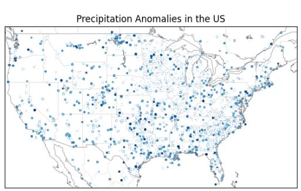  
Figure 2. Spatial patterns of climate anomalies (2016-2024). The left map shows precipitation anomalies (deep blue = wetter, light blue = drier), while the right map displays temperature anomalies (deep red = warmer, light blue = cooler). Precipitation anomalies are concentrated in the Midwest and western U.S., while high temperature anomalies are prominent in the South. The spatial overlap suggests regions experiencing compounding climate extremes.

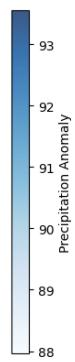

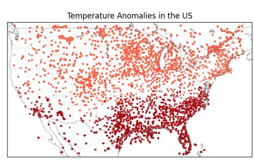

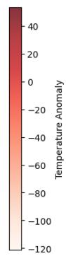

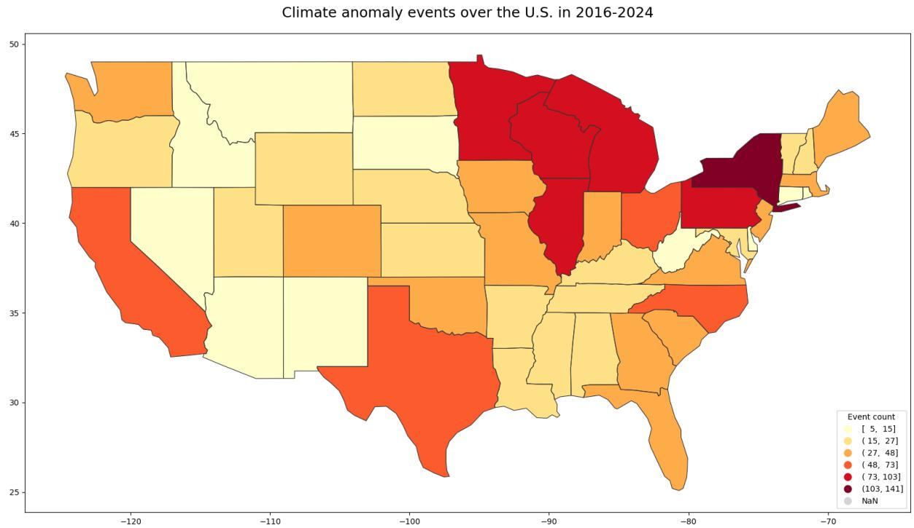

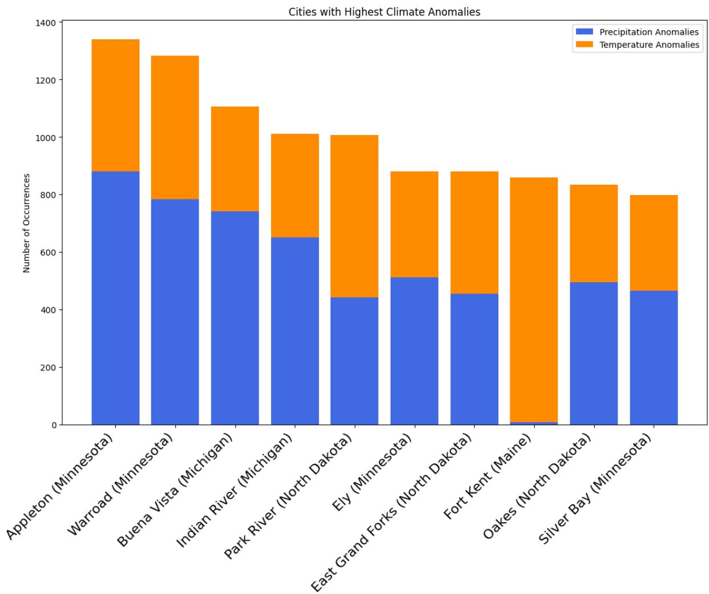  
Figure 3. Total climate anomaly events by state (2016-2024). The map uses a yellow-to-red gradient to represent the frequency of anomalies across the contiguous U.S. High concentrations are observed in New York, Pennsylvania, Texas, Florida, and parts of the Midwest, while the West, including California, shows moderate levels. The figure highlights regional disparities in climate anomaly occurrences over time.  
Figure 4. Top 20 U.S. cities by total number of climate anomaly days (2016-2024). The chart displays the number of days with precipitation anomalies (blue bars) and temperature anomalies (orange bars) for each city. Cities are sorted by the total

number of anomalous days. Most cities represented are located in the Midwest, North, and Northeast, suggesting these regions experience more frequent or concentrated extreme weather events. Southern and Western cities appear less frequently in the top ranks, possibly indicating milder or more distributed anomalies. Some cities, such as Appleton and Warroad, are more affected by precipitation anomalies, while others like Park River show a higher frequency of temperature anomalies, reflecting regional differences in climate dynamics.

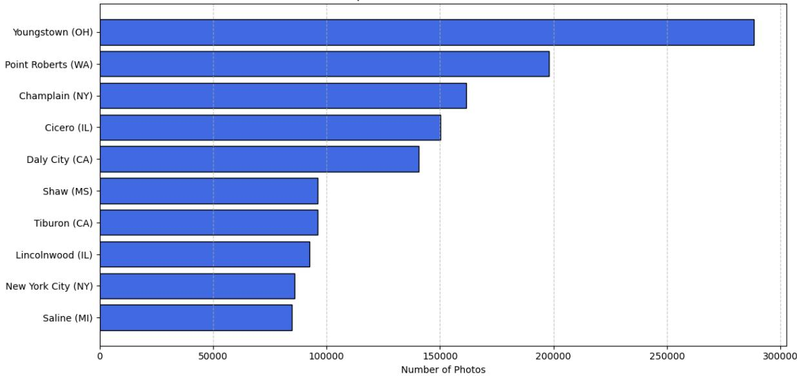  
Top 10 Cities with Most Flickr Posts  
Figure 5. Top cities by total number of

Flickr photo posts (2016-2024). This bar chart displays the cities with the highest volume of user-uploaded photos, with city names on the vertical axis and total post counts on the horizontal axis. The data reflects spatial patterns of social media engagement and user activity. Notably, cities with high photo activity often differ from those experiencing the most climate anomalies, suggesting that extreme weather events may not always correspond with increased online sharing.

To effectively interpret how climate anomalies influence public behavior, it is necessary to first establish a clear understanding of where and how these anomalies have occurred across space. Figures 2 to 4 provide a foundational spatial overview of climate anomaly patterns in

the contiguous United States between 2016 and 2024. Specifically, Figure 2 visualizes the national distribution of temperature and precipitation anomalies, highlighting regions that have experienced significant climatic deviations. Figure 3 further aggregates this information at the state level, offering insight into regional differences in climate stressor frequency. Figure 4 narrows the spatial focus to the city level, identifying urban areas with the highest number of anomalous days.

Together, these three figures outline the climatic landscape within which behavioral shifts might be expected to emerge. However, understanding the public response also requires attention to where social media activity is most concentrated. Therefore, Figure 5 presents the top cities by total number of Flickr photo uploads during the same period. This comparison reveals a potential mismatch between areas most affected by climate anomalies and areas with the highest levels of user activity. Identifying this discrepancy is critical, as it underscores the importance of accounting for spatial differences in data availability and engagement patterns when analyzing behavioral responses to environmental change.

Consequently, the subsequent analysis focuses not only on detecting behavioral changes associated with climate anomalies, but also on considering how regional differences in social media engagement may shape the observed patterns of response.